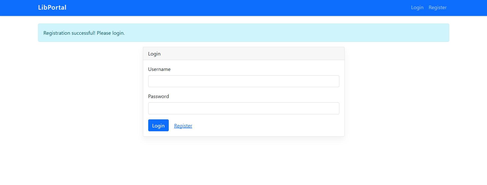
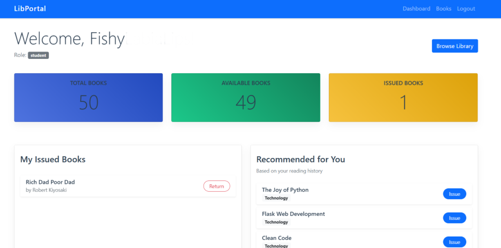
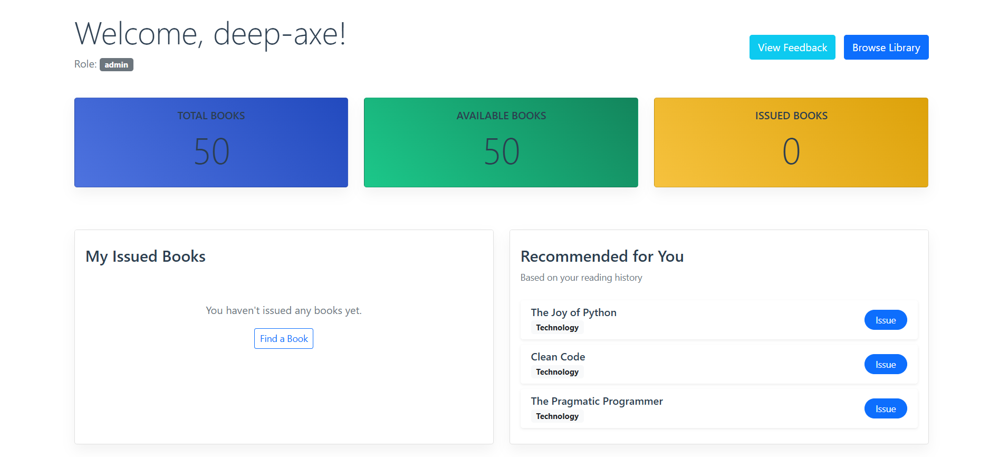
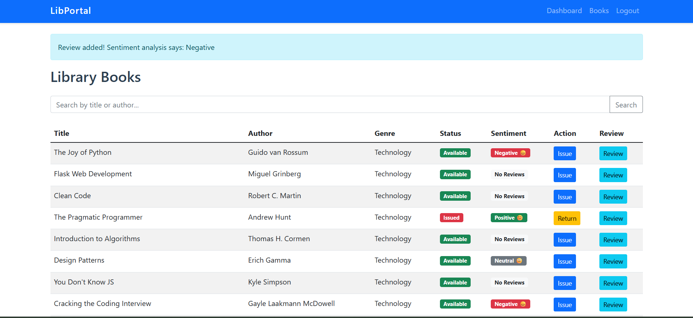
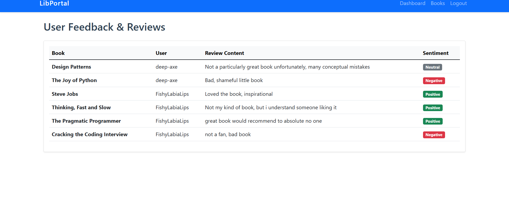
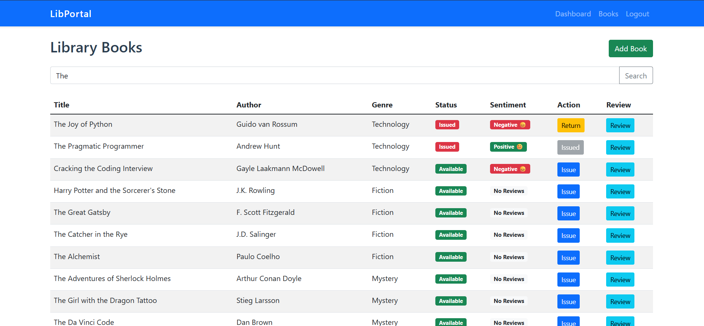

# LibPortal - Library Management System

**Course:** The Joy of Computing Using Python (noc25_cs103)  
**Student Name:** Deepam Ahuja

## 1. Project Overview

LibPortal is a library management system built with Python and Flask. It features Role-Based Access Control (RBAC), secure authentication, book management, sentiment analysis for reviews, and a user interface.

### Key Features:

- **User Authentication:** Secure registration and login with password complexity validation.
- **Role-Based Access Control:** Distinct features for Students (Issue/Return/Review) and Admins (Add Books/View Feedback).
- **Book Management:** Browse, search, issue, and return books.
- **Sentiment Analysis:** Automatic sentiment classification (Positive/Negative/Neutral) of user reviews using `TextBlob`.
- **Persistent Data:** All data is stored in JSON files (`books.json`, `users.json`, `reviews.json`).

## 2. How to Run

1.  Install dependencies: `pip install flask textblob`
2.  Run the application: `python app.py`
3.  Open browser at: `http://127.0.0.1:5000`

---

## 3. Source Code

### app.py (Main Application Logic)

```python
from flask import Flask, render_template, request, redirect, url_for, session, flash

from werkzeug.security import generate_password_hash, check_password_hash

import database
import utils

import random
import os

import re

app = Flask(__name__)
app.secret_key = 'key_for_libportal' #Removed during submission

# Initialize DB
database.init_db()

# --- Helpers ---
def get_current_user():
    if 'user_id' in session:
        users = database.get_users()
        for user in users:
            if user['id'] == session['user_id']:
                return user
    return None

def login_required(f):
    def wrapper(*args, **kwargs):
        if 'user_id' not in session:
            return redirect(url_for('login'))
        return f(*args, **kwargs)
    wrapper.__name__ = f.__name__
    return wrapper

def admin_required(f):
    def wrapper(*args, **kwargs):
        user = get_current_user()
        if not user or user['role'] != 'admin':
            flash("Access denied: Admins only.")
            return redirect(url_for('dashboard'))
        return f(*args, **kwargs)
    wrapper.__name__ = f.__name__
    return wrapper

# --- Routes ---

@app.route('/')
def index():
    return redirect(url_for('login'))

@app.route('/register', methods=['GET', 'POST'])
def register():
    if request.method == 'POST':
        username = request.form['username']
        password = request.form['password']
        role = request.form.get('role', 'student') # Default to student

        # Password Validation
        if len(password) < 8:
            flash('Password must be at least 8 characters long.')
            return redirect(url_for('register'))
        if not re.search(r"[A-Z]", password):
            flash('Password must contain at least one uppercase letter.')
            return redirect(url_for('register'))
        if not re.search(r"[a-z]", password):
            flash('Password must contain at least one lowercase letter.')
            return redirect(url_for('register'))
        if not re.search(r"[0-9]", password):
            flash('Password must contain at least one digit.')
            return redirect(url_for('register'))
        if not re.search(r"[!@#$%^&*(),.?\":{}|<>]", password):
            flash('Password must contain at least one special character.')
            return redirect(url_for('register'))

        users = database.get_users()
        if any(u['username'] == username for u in users):
            flash('Username already exists')
            return redirect(url_for('register'))

        new_user = {
            "id": len(users) + 1,
            "username": username,
            "password": generate_password_hash(password),
            "role": role,
            "history": [] # List of book IDs returned
        }
        users.append(new_user)
        database.save_users(users)
        flash('Registration successful! Please login.')
        return redirect(url_for('login'))
    return render_template('register.html')

@app.route('/login', methods=['GET', 'POST'])
def login():
    if request.method == 'POST':
        username = request.form['username']
        password = request.form['password']

        users = database.get_users()
        user = next((u for u in users if u['username'] == username), None)

        if user and check_password_hash(user['password'], password):
            session['user_id'] = user['id']
            session['role'] = user['role']
            return redirect(url_for('dashboard'))
        else:
            flash('Invalid credentials')

    return render_template('login.html')

@app.route('/logout')
def logout():
    session.clear()
    return redirect(url_for('login'))

@app.route('/dashboard')
@login_required
def dashboard():
    user = get_current_user()
    books = database.get_books()

    # Stats
    total_books = len(books)
    issued_books = len([b for b in books if b['status'] == 'Issued'])
    available_books = total_books - issued_books

    # Recommendations
    recommendations = utils.get_recommendations(user['history'], books)

    # My Issued Books
    my_books = [b for b in books if b['issued_to'] == user['id']]

    return render_template('dashboard.html', user=user,
                           total=total_books, issued=issued_books, available=available_books,
                           recommendations=recommendations, my_books=my_books)

@app.route('/books')
@login_required
def books():
    search_query = request.args.get('q', '').lower()
    all_books = database.get_books()
    reviews = database.get_reviews()

    # Calculate sentiment for each book
    book_sentiments = {}
    for book in all_books:
        book_reviews = [r['sentiment'] for r in reviews if r['book_id'] == book['id']]
        if book_reviews:
            # Simple logic: Majority wins, or "Mixed"
            pos = book_reviews.count('Positive')
            neg = book_reviews.count('Negative')
            neu = book_reviews.count('Neutral')

            if pos > neg and pos > neu:
                sentiment = "Positive"
            elif neg > pos and neg > neu:
                sentiment = "Negative"
            elif neu > pos and neu > neg:
                sentiment = "Neutral"
            else:
                sentiment = "Mixed"
            book_sentiments[book['id']] = sentiment
        else:
            book_sentiments[book['id']] = "No Reviews"

    if search_query:
        filtered_books = [b for b in all_books if search_query in b['title'].lower() or search_query in b['author'].lower()]
    else:
        filtered_books = all_books

    return render_template('books.html', books=filtered_books, user=get_current_user(), sentiments=book_sentiments)

@app.route('/admin/feedback')
@admin_required
def admin_feedback():
    reviews = database.get_reviews()
    books = database.get_books()
    users = database.get_users()

    # Enrich reviews with book and user names
    enriched_reviews = []
    for review in reviews:
        book = next((b for b in books if b['id'] == review['book_id']), None)
        user = next((u for u in users if u['id'] == review['user_id']), None)
        if book and user:
            enriched_reviews.append({
                "book_title": book['title'],
                "username": user['username'],
                "content": review['content'],
                "sentiment": review['sentiment']
            })

    return render_template('admin_feedback.html', reviews=enriched_reviews)

@app.route('/add_book', methods=['POST'])
@admin_required
def add_book():
    title = request.form['title']
    author = request.form['author']
    genre = request.form['genre']

    books = database.get_books()
    new_book = {
        "id": len(books) + 1,
        "title": title,
        "author": author,
        "genre": genre,
        "status": "Available",
        "issued_to": None
    }
    books.append(new_book)
    database.save_books(books)
    flash('Book added successfully!')
    return redirect(url_for('books'))

@app.route('/issue/<int:book_id>')
@login_required
def issue_book(book_id):
    books = database.get_books()
    user = get_current_user()

    for book in books:
        if book['id'] == book_id:
            if book['status'] == 'Available':
                book['status'] = 'Issued'
                book['issued_to'] = user['id']
                database.save_books(books)
                flash(f'You have issued {book["title"]}')
            else:
                flash('Book is not available')
            break
    return redirect(url_for('books'))

@app.route('/return/<int:book_id>')
@login_required
def return_book(book_id):
    books = database.get_books()
    users = database.get_users()
    user = get_current_user()

    for book in books:
        if book['id'] == book_id and book['issued_to'] == user['id']:
            book['status'] = 'Available'
            book['issued_to'] = None

            # Update user history for recommendations
            # We need to find the user object in the list to update it
            for u in users:
                if u['id'] == user['id']:
                    if book_id not in u['history']:
                        u['history'].append(book_id)
                    break

            database.save_books(books)
            database.save_users(users)
            flash(f'You have returned {book["title"]}')
            break
    return redirect(url_for('dashboard'))

@app.route('/review/<int:book_id>', methods=['POST'])
@login_required
def add_review(book_id):
    content = request.form['content']
    sentiment = utils.analyze_sentiment(content)

    reviews = database.get_reviews()
    reviews.append({
        "book_id": book_id,
        "user_id": session['user_id'],
        "content": content,
        "sentiment": sentiment
    })
    database.save_reviews(reviews)
    flash(f'Review added! Sentiment analysis says: {sentiment}')
    return redirect(url_for('books'))

if __name__ == '__main__':
    app.run(debug=True)

```

### database.py (Data Persistence)

```python
import json
import os

DATA_DIR = 'data'
BOOKS_FILE = os.path.join(DATA_DIR, 'books.json')
USERS_FILE = os.path.join(DATA_DIR, 'users.json')
REVIEWS_FILE = os.path.join(DATA_DIR, 'reviews.json')

def init_db():
    if not os.path.exists(DATA_DIR):
        os.makedirs(DATA_DIR)

    if not os.path.exists(BOOKS_FILE):
        # Initial dummy data
        books = [
            # Technology & Computer Science
            {"id": 1, "title": "The Joy of Python", "author": "Guido van Rossum", "genre": "Technology", "status": "Available", "issued_to": None},
            {"id": 2, "title": "Flask Web Development", "author": "Miguel Grinberg", "genre": "Technology", "status": "Available", "issued_to": None},
            {"id": 3, "title": "Clean Code", "author": "Robert C. Martin", "genre": "Technology", "status": "Available", "issued_to": None},
            {"id": 4, "title": "The Pragmatic Programmer", "author": "Andrew Hunt", "genre": "Technology", "status": "Available", "issued_to": None},
            {"id": 5, "title": "Introduction to Algorithms", "author": "Thomas H. Cormen", "genre": "Technology", "status": "Available", "issued_to": None},
            {"id": 6, "title": "Design Patterns", "author": "Erich Gamma", "genre": "Technology", "status": "Available", "issued_to": None},
            {"id": 7, "title": "You Don't Know JS", "author": "Kyle Simpson", "genre": "Technology", "status": "Available", "issued_to": None},
            {"id": 8, "title": "Cracking the Coding Interview", "author": "Gayle Laakmann McDowell", "genre": "Technology", "status": "Available", "issued_to": None},

            # Data Science & AI
            {"id": 9, "title": "Data Science from Scratch", "author": "Joel Grus", "genre": "Data Science", "status": "Available", "issued_to": None},
            {"id": 10, "title": "Deep Learning", "author": "Ian Goodfellow", "genre": "Data Science", "status": "Available", "issued_to": None},
            {"id": 11, "title": "Hands-On Machine Learning", "author": "Aurélien Géron", "genre": "Data Science", "status": "Available", "issued_to": None},
            {"id": 12, "title": "Pattern Recognition and Machine Learning", "author": "Christopher Bishop", "genre": "Data Science", "status": "Available", "issued_to": None},
            {"id": 13, "title": "Python for Data Analysis", "author": "Wes McKinney", "genre": "Data Science", "status": "Available", "issued_to": None},

            # Fiction & Classics
            {"id": 14, "title": "Harry Potter and the Sorcerer's Stone", "author": "J.K. Rowling", "genre": "Fiction", "status": "Available", "issued_to": None},
            {"id": 15, "title": "To Kill a Mockingbird", "author": "Harper Lee", "genre": "Fiction", "status": "Available", "issued_to": None},
            {"id": 16, "title": "1984", "author": "George Orwell", "genre": "Fiction", "status": "Available", "issued_to": None},
            {"id": 17, "title": "The Great Gatsby", "author": "F. Scott Fitzgerald", "genre": "Fiction", "status": "Available", "issued_to": None},
            {"id": 18, "title": "Pride and Prejudice", "author": "Jane Austen", "genre": "Fiction", "status": "Available", "issued_to": None},
            {"id": 19, "title": "The Catcher in the Rye", "author": "J.D. Salinger", "genre": "Fiction", "status": "Available", "issued_to": None},
            {"id": 20, "title": "Brave New World", "author": "Aldous Huxley", "genre": "Fiction", "status": "Available", "issued_to": None},
            {"id": 21, "title": "The Alchemist", "author": "Paulo Coelho", "genre": "Fiction", "status": "Available", "issued_to": None},

            # Mystery & Thriller
            {"id": 22, "title": "The Adventures of Sherlock Holmes", "author": "Arthur Conan Doyle", "genre": "Mystery", "status": "Available", "issued_to": None},
            {"id": 23, "title": "Gone Girl", "author": "Gillian Flynn", "genre": "Mystery", "status": "Available", "issued_to": None},
            {"id": 24, "title": "The Girl with the Dragon Tattoo", "author": "Stieg Larsson", "genre": "Mystery", "status": "Available", "issued_to": None},
            {"id": 25, "title": "The Da Vinci Code", "author": "Dan Brown", "genre": "Mystery", "status": "Available", "issued_to": None},
            {"id": 26, "title": "And Then There Were None", "author": "Agatha Christie", "genre": "Mystery", "status": "Available", "issued_to": None},

            # Fantasy & Sci-Fi
            {"id": 27, "title": "The Hobbit", "author": "J.R.R. Tolkien", "genre": "Fantasy", "status": "Available", "issued_to": None},
            {"id": 28, "title": "Dune", "author": "Frank Herbert", "genre": "Sci-Fi", "status": "Available", "issued_to": None},
            {"id": 29, "title": "The Name of the Wind", "author": "Patrick Rothfuss", "genre": "Fantasy", "status": "Available", "issued_to": None},
            {"id": 30, "title": "Ender's Game", "author": "Orson Scott Card", "genre": "Sci-Fi", "status": "Available", "issued_to": None},
            {"id": 31, "title": "A Game of Thrones", "author": "George R.R. Martin", "genre": "Fantasy", "status": "Available", "issued_to": None},

            # History & Biography
            {"id": 32, "title": "Sapiens: A Brief History of Humankind", "author": "Yuval Noah Harari", "genre": "History", "status": "Available", "issued_to": None},
            {"id": 33, "title": "Educated", "author": "Tara Westover", "genre": "Biography", "status": "Available", "issued_to": None},
            {"id": 34, "title": "Becoming", "author": "Michelle Obama", "genre": "Biography", "status": "Available", "issued_to": None},
            {"id": 35, "title": "Steve Jobs", "author": "Walter Isaacson", "genre": "Biography", "status": "Available", "issued_to": None},
            {"id": 36, "title": "Guns, Germs, and Steel", "author": "Jared Diamond", "genre": "History", "status": "Available", "issued_to": None},
            {"id": 37, "title": "The Diary of a Young Girl", "author": "Anne Frank", "genre": "Biography", "status": "Available", "issued_to": None},

            # Science & Philosophy
            {"id": 38, "title": "Cosmos", "author": "Carl Sagan", "genre": "Science", "status": "Available", "issued_to": None},
            {"id": 39, "title": "A Brief History of Time", "author": "Stephen Hawking", "genre": "Science", "status": "Available", "issued_to": None},
            {"id": 40, "title": "Thinking, Fast and Slow", "author": "Daniel Kahneman", "genre": "Psychology", "status": "Available", "issued_to": None},
            {"id": 41, "title": "Meditations", "author": "Marcus Aurelius", "genre": "Philosophy", "status": "Available", "issued_to": None},
            {"id": 42, "title": "The Selfish Gene", "author": "Richard Dawkins", "genre": "Science", "status": "Available", "issued_to": None},
            {"id": 43, "title": "Beyond Good and Evil", "author": "Friedrich Nietzsche", "genre": "Philosophy", "status": "Available", "issued_to": None},

            # Business & Self-Help
            {"id": 44, "title": "Atomic Habits", "author": "James Clear", "genre": "Self-Help", "status": "Available", "issued_to": None},
            {"id": 45, "title": "Rich Dad Poor Dad", "author": "Robert Kiyosaki", "genre": "Business", "status": "Available", "issued_to": None},
            {"id": 46, "title": "Zero to One", "author": "Peter Thiel", "genre": "Business", "status": "Available", "issued_to": None},
            {"id": 47, "title": "The Power of Habit", "author": "Charles Duhigg", "genre": "Self-Help", "status": "Available", "issued_to": None},
            {"id": 48, "title": "How to Win Friends and Influence People", "author": "Dale Carnegie", "genre": "Self-Help", "status": "Available", "issued_to": None},
            {"id": 49, "title": "Deep Work", "author": "Cal Newport", "genre": "Self-Help", "status": "Available", "issued_to": None},
            {"id": 50, "title": "Shoe Dog", "author": "Phil Knight", "genre": "Business", "status": "Available", "issued_to": None}
        ]
        save_data(BOOKS_FILE, books)

    if not os.path.exists(USERS_FILE):
        users = []
        save_data(USERS_FILE, users)

    if not os.path.exists(REVIEWS_FILE):
        save_data(REVIEWS_FILE, [])

def load_data(filename):
    if not os.path.exists(filename):
        return []
    with open(filename, 'r') as f:
        try:
            return json.load(f)
        except json.JSONDecodeError:
            return []

def save_data(filename, data):
    with open(filename, 'w') as f:
        json.dump(data, f, indent=4)

def get_books():
    return load_data(BOOKS_FILE)

def save_books(books):
    save_data(BOOKS_FILE, books)

def get_users():
    return load_data(USERS_FILE)

def save_users(users):
    save_data(USERS_FILE, users)

def get_reviews():
    return load_data(REVIEWS_FILE)

def save_reviews(reviews):
    save_data(REVIEWS_FILE, reviews)

```

### utils.py (Helper Functions)

```python
import random
from textblob import TextBlob

def analyze_sentiment(text):
    blob = TextBlob(text)
    polarity = blob.sentiment.polarity
    if polarity > 0.1:
        return "Positive"
    elif polarity < -0.1:
        return "Negative"
    else:
        return "Neutral"

# --- Recommendation System (Course Topic: Six Degrees/Similarities) ---
def get_recommendations(user_history, all_books):
    # Simple recommendation: Recommend books from genres the user has read
    if not user_history:
        # Random recommendation if no history
        return random.sample(all_books, min(3, len(all_books)))

    read_genres = set()
    for book_id in user_history:
        # Find book genre (inefficient but simple for small lists)
        for b in all_books:
            if b['id'] == book_id:
                read_genres.add(b['genre'])
                break

    recommendations = []
    for book in all_books:
        if book['genre'] in read_genres and book['id'] not in user_history:
            recommendations.append(book)

    if not recommendations:
        # Fallback to random
        return random.sample(all_books, min(3, len(all_books)))

    return recommendations[:3]
```

---

## 4. Screenshots

**1. Login Page**


**2. Dashboard (Student View)**


**3. Dashboard (Admin View)**


**4. Book Catalog with Sentiment Analysis**


**5. Admin Feedback View**


**6. Catalogue Search**

